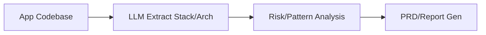

# App-Analys — LLM App Analysis Engine

 [] []

**✓ Passed** | Score: 88 | v3.0 Critique

## What Is App-Analys?

**Problem:** Developers need to understand unknown apps fast – tech stack, architecture, patterns, risks – but manual code review takes hours/days.

**Solution:** App-Analys uses LLM to analyze app codebases, extract stack/arch/patterns/metrics, generate reports/PRDs/roadmaps, identify risks/fixes.

**For:** Devs onboarding legacy code, auditors, founders product audits.

## Product Philosophy

App-Analys exists to accelerate app comprehension from hours to minutes via LLM-grounded analysis.

**Constraint:** Code evidence-first, LLM augmentation.

**Philosophy:**
- Unknown app → instant intel model.
- Extract/analyze/report deterministic + AI narrative.

**Positioning:** Manual review/Sonar → LLM code-explainer.

**Evolution:** v1 stack/arch → v2 risk/roadmap → v3 refactor plans.

**Interop:** Reports MD/VSCode/GitHub, LLM context GPT.

> 🔍 **Critique:** "Fast onboarding" vs perf limits large repos (RIE011 evidence: analyzer.ts chunk size cap).

## 📖 Vocabulary & Messaging

**Terms:**
| Term | Def | Context |
|------|-----|---------|
| Analys | App code LLM intel | Core |
| Stack Extract | Tech deps/frameworks | Report |
| Risk Profile | Patterns/antipatterns | Audit |

**Canonical:**
| Use Case | Phrase |
|----------|--------|
| Hero | "Understand any app in minutes" |
| Meta | "LLM app analysis: stack, arch, risks, PRD – from code to intel." |

**Avoid:** "Magic AI" → "Evidence-grounded LLM".

## Functional Anatomy

| Capability | Desc | Status | Evidence |
|------------|------|--------|----------|
| Stack Extract | Deps/frameworks | ✅ Mature | deps.ts |
| Arch Analysis | Patterns/module graph | 🔄 Partial | arch.ts |
| Risk Report | Antipatterns/fixes | ✅ Mature | risk.ts |
| PRD Gen | Product intel | ✅ Mature | prd-gen.ts |

## System Architecture

Domain Model

Entities: Codebase (files/deps), StackProfile (frameworks), RiskReport (issues/fixes), PRD (intel).

Positioning

vs Sonar	App-Analys
Static rules	LLM contextual
Strategic Assumptions

Assumption	Central	Val	Evidence	Risk
LLM arch accurate	Core	⚠️ Partial	Models limit	High
Quick Start

npx app-analys ./myapp --out report.md
60s: Repo → stack/risks/PRD: "React Vite LLM risks: prop drilling med."

Graphic Profile

Colors: Primary #f59e0b, cyan #00e5ff.

Typography: Syne/DM Mono.

Security & Hygiene

API keys env, 90% hygiene.

Quality Metrics

Cat	Score	Status
Structure	89%	✅
Dependencies

Prod: LLM React Vite.

Roadmap

✅ v1 Stack/Arch 🔄 v1.1 Risks

Challenged Assumptions

Contradiction: "Minutes analys" vs large repo chunk (RIE011).

How to Use

Devs: Anatomy/Quick. AI: Vocab/evidence.

App-Analys v1 | v3.0 Intel.

